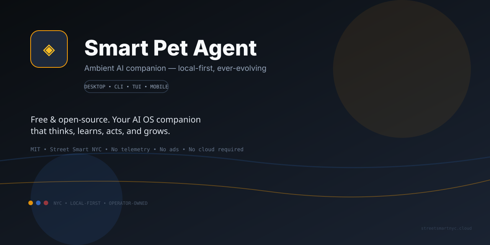

# Smart Pet Agent

> Free, open-source, ever-evolving AI OS companion — Street Smart NYC.

Smart Pet Agent is a **standalone ambient AI companion** that lives on your computer. Unlike simple desktop pets, Smart is driven by **agent thought**: every action, animation, and response is reasoned, not randomized.

## Get started

- **New here?** → [Quickstart](quickstart.md) — install, configure a provider, and run your first task in 5 minutes.
- **Providers** → [Providers overview](providers.md) and [LLM providers](llm-providers.md) for Ollama, OpenAI, Anthropic, Google, LiteLLM and custom endpoints.
- **Pets** → [PETS.md](PETS.md) + [Templates](templates.md) + [Custom Pet Spec](CUSTOM_PET_SPEC.md).
- **Trust model** → [TRUST.md](TRUST.md) — permission gates, audit log, and destructive-action policy.

## Surfaces

One runtime (`packages/core`) — many shells: **Desktop (Electron + Tauri), CLI, TUI, and scaffolded mobile (Expo)**. See [Architecture](architecture.md).

## Project links

- GitHub: <https://github.com/realstreetsmartnyc/smart-pet-agent>
- Contributing: [contributing.md](contributing.md)
- Architecture: [architecture.md](architecture.md)

> Status: private alpha / technical preview (see [Release Checklist](RELEASE_CHECKLIST.md) and [PUBLISH_READINESS_AUDIT_2026-09-01_FULL.md](PUBLISH_READINESS_AUDIT_2026-09-01_FULL.md)).
